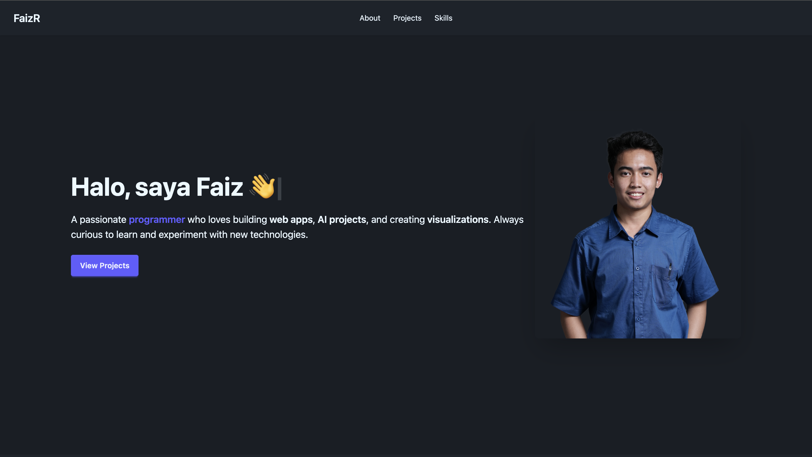
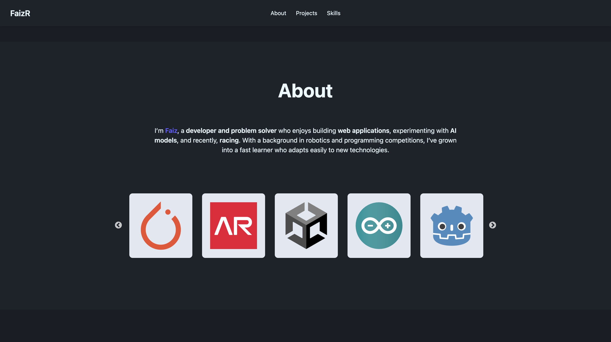
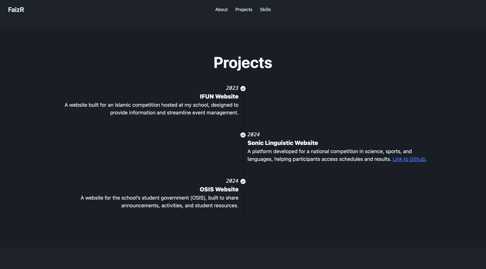
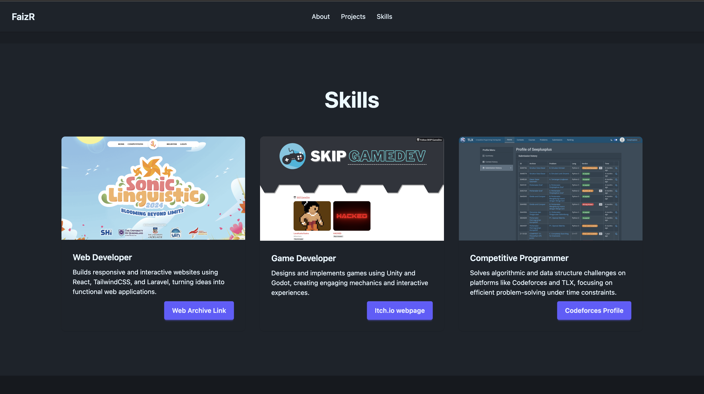

# My Portfolio Website

## Access Method

I've decided to deploy my website externally on github.

**Github Pages**: https://faizr206.github.io/my-portfolio/

---

## Site Overview & Audience

This portfolio website is designed as a **personal showcase** to present my skills, projects, and background in a clear and engaging way. The goal is to create a simple but professional digital presence that can be shared with peers, instructors, and potential collaborators.

The audience includes **instructors**, **classmates**, **friends**, and potentially **future employers** who want to quickly understand my work and interests. The site highlights who I am, what I’ve built, and what I aim to do in the future.

---

## Site Map

The website is a **single-page application** with multiple sections:

- **Hero Section** → Greeting with a typing effect in multiple languages.
- **About** → A short introduction about me and what tool I have learned so far.
- **Projects** → A showcase of selected projects with brief descriptions and links.
- **Skills** → A showcase of some of my skills as well as the framework/platform that i use.

Navigation links in the header scroll smoothly to each section. There is also a footer containing my social media such as instagram and linkedin.

---

## Design Notes

- Built with **Vite + React + Tailwind CSS + DaisyUI** for a clean and modern UI.
- Color palette and typography were chosen for a **professional yet approachable** feel.
- The typing effect in multiple languages makes the site more **dynamic and personal**.
- Sections are kept minimal to focus attention on key information.

---

## Screenshots

Example placeholders:

1. Hero

2. About

3. Projects

4. Skills

---

## Credits

- **Frameworks & Libraries**:

  - [React](https://react.dev/)
  - [Vite](https://vitejs.dev/)
  - [Tailwind CSS](https://tailwindcss.com/)
  - [DaisyUI](https://daisyui.com/)
  - [react-simple-typewriter](https://www.npmjs.com/package/react-simple-typewriter)
  - [react-slick](https://react-slick.neostack.com/)

- **Icons & Media**: 
  - [fontawesome icon](https://fontawesome.com/)
  - Images for tools and software logo
    - https://uxwing.com/wp-content/themes/uxwing/download/brands-and-social-media/unity-game-engine-icon.png
    - https://cdn.worldvectorlogo.com/logos/arduino-1.svg
    - https://upload.wikimedia.org/wikipedia/commons/thumb/6/6a/Godot_icon.svg/2048px-Godot_icon.svg.png
    - https://upload.wikimedia.org/wikipedia/commons/thumb/1/18/ISO_C%2B%2B_Logo.svg/640px-ISO_C%2B%2B_Logo.svg.png
    - https://upload.wikimedia.org/wikipedia/commons/thumb/c/c3/Python-logo-notext.svg/1200px-Python-logo-notext.svg.png
    - https://upload.wikimedia.org/wikipedia/commons/thumb/3/3c/Logo_C_sharp.png/640px-Logo_C_sharp.png
    - https://upload.wikimedia.org/wikipedia/commons/thumb/9/9a/Laravel.svg/1969px-Laravel.svg.png
    - https://cdn.creazilla.com/icons/3254256/pytorch-icon-size_256.png
    - https://cdn.mobygames.com/promos/4943010-assoluto-racing-logo.png

---

## Bonus Features

- **Typing Effect with Multiple Languages**
  - Implemented using `react-simple-typewriter`.
  - Displays greetings in Indonesian, English, German, and Arabic with a looping typing effect.
  - Makes the hero section more lively and personal.

- **Automatic Sliding Carousel**
  - Implemented using `react-slick`.
  - Displays tools logo in image in a horizontally sliding carousel.
  - Features infinite looping, autoplay every 2 seconds.
  - Enhances the portfolio by visually showcasing skills in a dynamic, interactive way.

---
